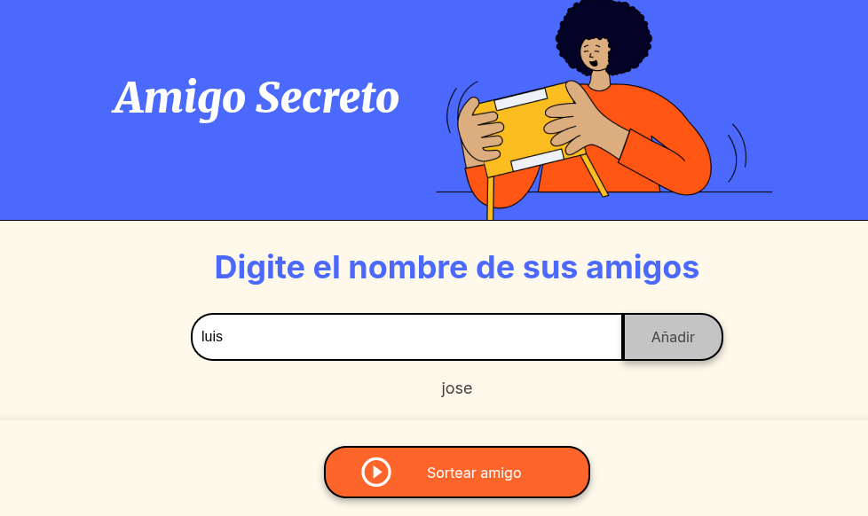
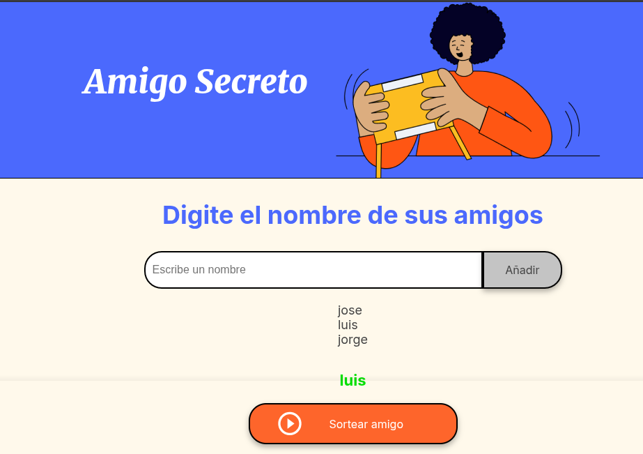

# 🎯 Sorteo de Amigo Secreto 

[](https://github.com/hackanonimous/challenge-amigo-secreto)
[](https://hackanonimous.github.io/challenge-amigo-secreto)
[](https://opensource.org/licenses/MIT)

> ¡Una solución divertida y práctica para sortear amigos secretos! Agrega participantes, valida entradas y genera emparejamientos aleatorios perfectos para tus intercambios de regalos.

---

## 🔍 Tabla de Contenidos
1. [Cómo Funciona](#✨-cómo-funciona)
2. [Demo en Vivo](#🌐-demo-en-vivo)
3. [Características](#🚀-características)
4. [Tecnologías Usadas](#🧪-tecnologías-usadas)
5. [Instalación Local](#💻-instalación-local)
6. [Futuras Mejoras](#🔮-futuras-mejoras)
7. [Contribución](#🤝-contribución)

---

## ✨ Cómo Funciona
1. **Agrega amigos** en el campo de entrada
2. **Valida** que no haya entradas vacías o duplicados
3. **Realiza el sorteo** cuando tengas suficientes participantes
4. **¡Descubre** quién es tu amigo secreto!

---
## 🌐 Demo en Vivo

**¡Prueba la aplicación directamente en tu navegador!**

[](https://hackanonimous.github.io/challenge-amigo-secreto)

**Capturas de Pantalla:**
- Agregando Participantes
  
- Resultado del sorteo


---
## 🚀 Características

- Validación en tiempo real de entradas
- Interfaz intuitiva con feedback visual
- Algoritmo aleatorio justo y equilibrado
- Manejo de errores para casos especiales
- Responsive design funciona en móviles y desktop

---
## 🧪 Tecnologías Usadas
- JavaScript ES6+ (Funciones, ciclos, DOM manipulation)
- HTML5 (Estructura semántica)
- CSS3 (Estilos básicos)
- GitHub Pages (Deploy automático)

---
## 💻 Instalación Local
1. Clona el repositorio
```bash
git clone https://github.com/hackanonimous/challenge-amigo-secreto.git
```
2. Abre el archivo principal
```bash
cd challenge-amigo-secreto
open index.html # o simplemente has doble clic en el archivo
```
---
## 🔮 Futuras Mejoras
¡Tus ideas son bienvenidas! Estas son algunas mejoras planeadas:
|Mejora|Estado|Prioridad|
|-------|------|--------|
|Mejorar diseño de alertas|✨ Planeado|Alta
|Agregar animaciones|💡 Ideas|Media
|Validar caracteres especiales|🚀 En progreso|Alta
|Guardar historial de sorteos|✨ Planeado|Baja
|Compatir resultados|💡 Ideas|Media

¡Sugiere nuevas características [creando un issue aqui]([faceoobo.com](https://github.com/hackanonimous/challenge-amigo-secreto/issues)) !

---
## 🤝 Contribución
**¿Quieres mejorar este proyecto?¡Sigue estos pasos!**
1. 🍴 Haz un fork del repositorio
2. 🌿 Crea una rama: git checkout -b mi-mejora
3. 💾 Haz commit de tus cambios: git commit -m 'Agrega nueva característica'
4. 🚀 Haz push: git push origin mi-mejora
5. 📬 Abre un Pull Request
**Recomendaciones para contribuir:**
- Mantén el código simple y legible
- Añade comentarios donde sea necesario
- Prueba tus cambios antes de enviar

🌟 Este proyecto fue desarrollado como parte del programa de formación de Alura Latam.
💌 ¿Preguntas? ¡Contáctame en linkeding!

[](https://www.linkedin.com/in/jalvarez-dev/)

